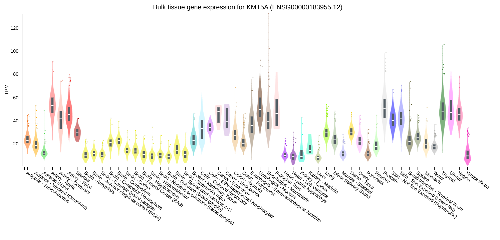
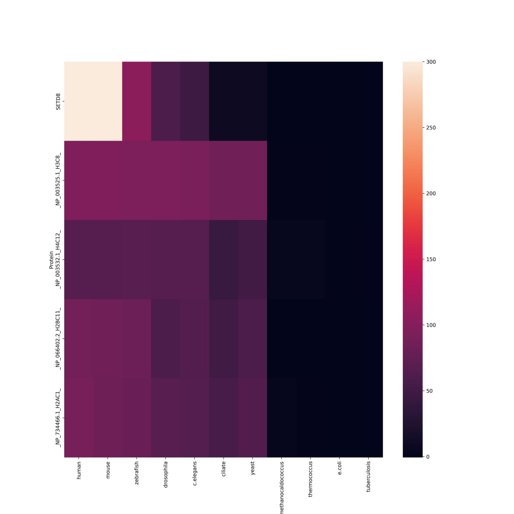

# H4_2023
[Презентация](https://docs.google.com/presentation/d/1F4dUlENxob7fgh7ZhpvLQgsTBeF9cVmZ7toJN-iI13M/edit#slide=id.g2503a943df0_0_9)

Исходный код, использованный в процессе подготовки данных, находится в [папке src](src/)

Групповые результаты:

Индивидуальные результаты приведены ниже этой секции в личных репозиториях участников группы.

SETD8 (KMT5A) - белок эпигенетической модификации метилирования с меткой write.

Его функция [заключается](https://www.ncbi.nlm.nih.gov/pmc/articles/PMC8897848/) в метилировании гистона H4.

Экспрессия SETD8:

Тепловая карта по SETD8:

Исходная информация по E-value находится в файлах SETD8-e.txt и SETD8-h.txt.

Из выше полученных данных можно сделать, что скорее всего белок появился вместе с с беспозвоночными (drosophila).
