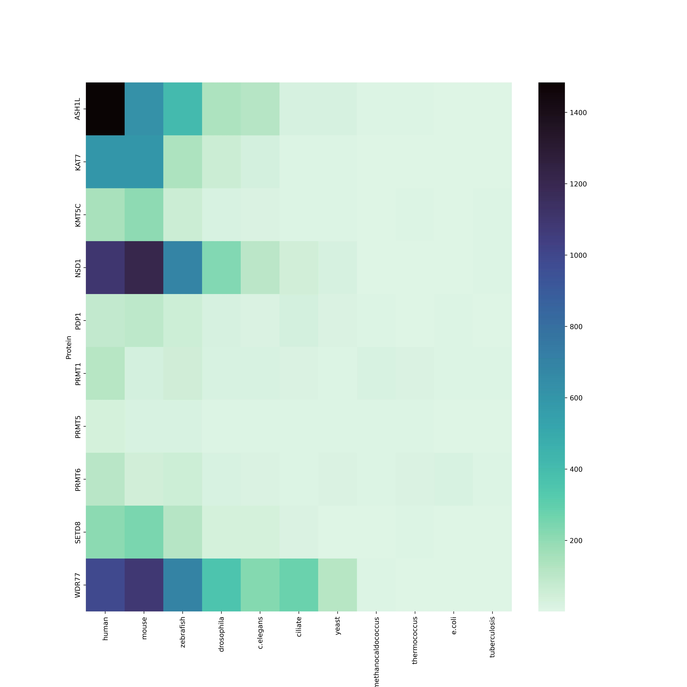
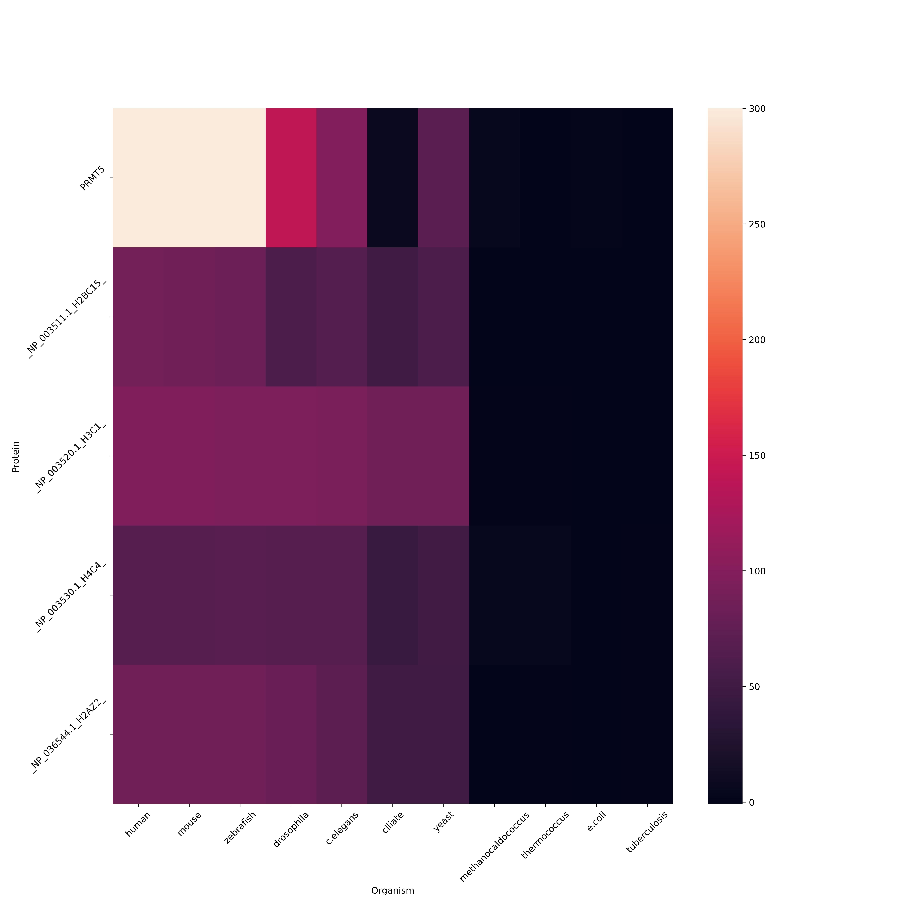

# H4_2023
[Презентация](https://docs.google.com/presentation/d/1F4dUlENxob7fgh7ZhpvLQgsTBeF9cVmZ7toJN-iI13M/edit#slide=id.g2503a943df0_0_9)

Исходный код, использованный в процессе подготовки данных, находится в [папке src](src/)

Групповые результаты:

Индивидуальные результаты приведены ниже этой секции в личных репозиториях участников группы.

PRMT5 - белок эпигенетической модификации метилирования с меткой write.

Его функция [заключается](https://pubmed.ncbi.nlm.nih.gov/34492270/) в метилировании гистона H4.

Таблица с e-value по PRMT-5 [table.md](data/table.md)

Исходные данные по PRMT5 приведены в [папке data](data/)

Тепловая карта по PRMT5:

Совокупность описанных выше данных позволяет предположить, что белок появился в эволюции вместе с беспозвоночными (drosophila).
